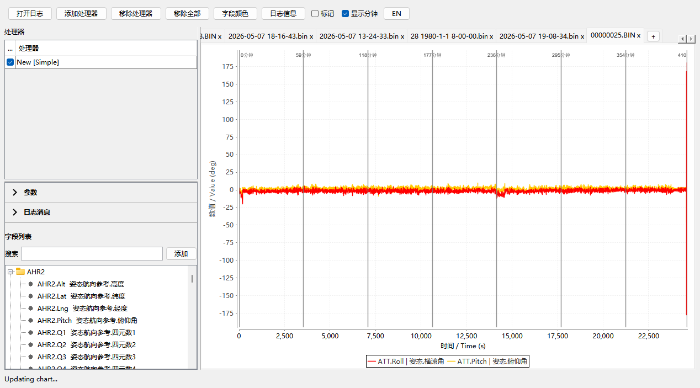

# FlightPlot 0.5.8

FlightPlot 是面向 PX4 和 ArduPilot/APM 的桌面飞行日志分析工具。0.5.8 集中解决大日志打开、窗口缩放、HiDPI 清晰度、多日志并发操作、动态字段发现、字段选择继承和重复对话框等问题。



## 支持的日志

- PX4 / ArduPilot DataFlash：`.bin`、`.BIN`、`.px4log`
- ArduPilot DataFlash 文本日志：`.log`
- PX4 ULog：`.ulg`

字段树直接读取当前文件里的 DataFlash `FMT/FMTU` 或 ULog schema。固件新增的消息、实例、数组元素和字段可在重新打开日志时自动出现，不依赖固定字段清单。

## 0.5.8 功能

- 从工具栏、菜单、命令行或拖放打开日志，多入口共用同一套打开逻辑。
- 大 BIN 建立索引并按需读取可见时间范围；绘图采用保峰抽稀，降低内存和刷新开销。
- 多日志页独立保存图表、处理器、缩放和消息状态，可快速切换和关闭。
- 相同格式日志自动恢复已有处理器、勾选状态和字段颜色；缺少的字段会安全跳过。
- 字段树支持搜索、多选、自然数字排序和双击添加；已存在但取消勾选的字段会重新启用。
- 16 类处理器、参数编辑、预设导入导出、图片导出、KML/GPX 航迹和参数导出。
- 多选移除、单次确认的全部移除、自定义 RGB、底部颜色图例、标记点和分钟线。
- 中英文即时切换，支持 Windows 100%–250% 显示缩放与常见窗口尺寸。
- 同类对话框单实例管理，避免连续点击导致窗口叠加和模态卡顿。

## 快速开始

要求：JDK 8 或更高版本。无需安装项目专用 JDK，也无需把飞行日志放进源码仓库。

```powershell
./build-responsive.ps1
java -Xms64m -Xmx512m -XX:+UseG1GC -XX:MaxGCPauseMillis=50 -jar build/FlightPlot-responsive-0.5.8.jar
```

也可使用系统安装的 Ant：

```powershell
ant clean all
java -jar out/production/flightplot.jar
```

运行回归和生成发布包：

```powershell
./verify-responsive.ps1
./package-responsive.ps1
```

发布文件生成在 `release/0.5.8/`。`verify-responsive.ps1` 默认执行不含私有日志的自包含测试；如需真实日志覆盖，可在本地创建被 Git 忽略的 `日志示例/` 目录。

## 文档

- [用户使用说明](docs/USER_GUIDE.md)
- [功能与边界清单](docs/FEATURE_MATRIX.md)
- [架构与数据流](docs/ARCHITECTURE.md)
- [源码阅读和扩展示例](docs/SOURCE_GUIDE.md)
- [测试说明](docs/TESTING.md)
- [0.5.8 发布说明](docs/RELEASE_NOTES_0.5.8.md)
- [第三方组件与许可证](docs/THIRD_PARTY_NOTICES.md)
- [参与开发](CONTRIBUTING.md)
- [安全问题报告](SECURITY.md)

## 项目来源与许可证

本项目基于 [PX4/FlightPlot](https://github.com/PX4/FlightPlot)（其历史来自 [DrTon/FlightPlot](https://github.com/DrTon/FlightPlot)）继续维护。0.5.8 的维护者改动按 [BSD 3-Clause](LICENSE) 发布；内嵌代码和二进制依赖仍遵循各自许可证，详情见 [THIRD_PARTY_NOTICES.md](docs/THIRD_PARTY_NOTICES.md)。
