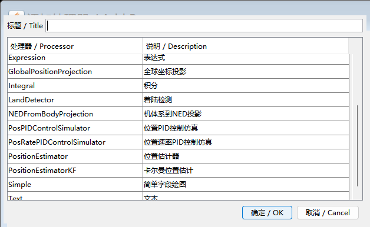
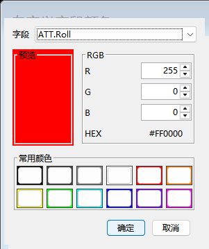

# FlightPlot 0.5.8 使用说明

## 启动

Windows 发布包解压后双击 `Start-FlightPlot.cmd`。也可以直接运行：

```powershell
java -jar FlightPlot-responsive-0.5.8.jar
```

建议保留默认的 512MB 最大堆。大日志采用索引和按需读取，不需要把堆设置为日志文件大小。

## 打开日志

以下方式行为一致：

- 点击左上角“打开日志”；
- 使用“文件 → 打开日志”；
- 把日志拖到主窗口；
- 将日志路径作为启动参数传入。

打开新文件时会显示独立日志页。相同文件已经打开时会切换到已有页。连续拖入或打开时，较新的操作可以取消旧的未完成任务，界面不会同时弹出多个文件或错误窗口。

支持 `.bin/.BIN/.px4log/.log/.ulg`。字段列表来自当前日志内容，因此不同飞控、固件版本和消息实例会显示各自实际字段。

## 选择字段

1. 在“字段列表”展开消息组，或在搜索框输入字段名/中文说明。
2. 单击字段后按 Add，或直接双击字段。
3. 新字段以 Simple 处理器加入左上方处理器表，并默认勾选绘图。
4. 如果字段已经存在但曾取消勾选，再次双击会恢复勾选。
5. 如果字段已经勾选，再次双击只高亮对应处理器，便于定位，不会重复添加。

RCIN、RCOU 等带数字通道按自然顺序显示，例如 C1、C2、C3、C10。

## 跨日志沿用选择

打开相同格式的下一份日志时，0.5.8 会恢复上一份日志的：

- 已创建处理器及参数；
- 每个处理器的勾选状态；
- 每个字段的自定义颜色。

新日志缺少某字段时只跳过该字段，其他可用项继续恢复。不同格式使用独立记忆，防止 DataFlash 和 ULog 的字段互相污染。无论通过按钮、菜单、命令行或拖放打开，规则相同。

## 处理器

- “添加处理器”：选择 16 类处理器之一并编辑标题、输入字段和参数。
- 双击处理器行：编辑当前处理器。
- 表格最左侧复选框：显示或隐藏对应曲线。
- “移除处理器”：删除多段高亮行；若没有高亮行，则删除已勾选项。
- “移除全部”：只显示一次确认，确认后清空当前页。

处理器属于当前日志页。切换页时，表格和图表同时切换，不会把其他页的运行状态混入当前页。

## 自定义颜色

选择一个处理器后点击“字段颜色”，在字段下拉框选择该处理器的输出字段，再选择 RGB 颜色。确认后曲线和底部图例立即更新。取消不会修改颜色。





## 图表操作

- 鼠标滚轮缩放时间范围；拖动图表进行平移。
- “标记”控制曲线数据点。
- “显示分钟”控制顶部分钟线。
- “视图”菜单可切换日志相对时间、启动时间和 GPS/UTC 时间。
- 底部图例的颜色与当前曲线一致；自定义颜色会同步更新。

窗口缩放或移动到不同 DPI 的显示器时，布局会重新计算。对话框尺寸受当前显示器工作区限制，不应互相覆盖。

## 参数、消息与日志信息

左侧“参数”和“日志消息”使用明显的展开/收起箭头。大型日志的内容按需填充，以减少首次打开时间。顶部“日志信息”显示当前文件格式、版本、起止时间、消息统计和解析提示。

## 导出

“文件”菜单提供：

- 图表图片；
- 参数文本；
- KML 航迹；
- GPX 航迹；
- 处理器预设导入与导出。

导出前确认当前日志含有所需字段。缺字段或目标文件写入失败时，程序会保留当前页并给出一次错误提示。

## 常见问题

**字段列表没有某个新字段**
确认日志本身含有对应 FMT/FMTU 或 ULog schema。重新打开文件会重新解析字段，不使用旧白名单。

**打开大文件时状态栏显示处理中**
索引在后台生成，主窗口仍可操作。再次打开其他日志会取消过期任务。

**相同格式没有恢复某字段**
新日志中没有完全相同的原生字段键时会跳过；检查消息实例和数组下标是否变化。

**程序无法启动**
运行 `java -version`，确认安装 JDK/JRE 8 或更高版本，并使用完整解压后的发布目录。
